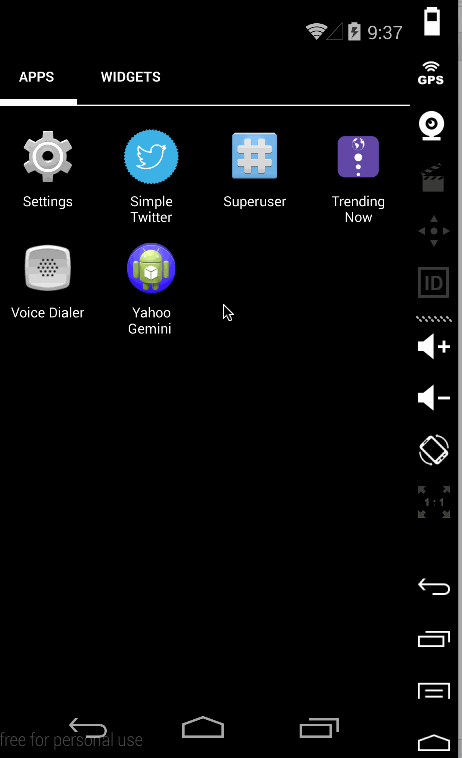

TwitterAppClient
================

   * [x] Style the login screen for twitter
   * [x] Pick a good Twitter launcher icon
   * [x] Properly theme the ActionBar with correct text and background colors
   * [x] Theme the tabs to fit a "twitter" color scheme
   * [x] On compose screen, the "post" button should be customized (images or drawables) with a pressed state
   * [x] Add inline "favorite" and "reply" icons to each tweet. Favorite icon should toggle when pressed.
   
 
 Walkthrough 
 --- 

